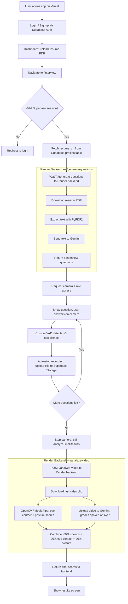

<div align="center">

# 🎙️ MOCKSTAR — AI Mock Interview Platform

**Upload a resume, get 5 AI-generated interview questions, answer on camera, get scored on what you said and how you presented.**


</div>

---

## What This Does

1. User signs up / logs in (Supabase Auth)
2. User uploads a resume PDF
3. Backend reads the resume, asks Gemini to generate 5 tailored interview questions
4. User answers each question on camera — a custom silence-detector auto-stops recording
5. Each answer is uploaded to Supabase Storage
6. After the last question, the backend scores the final answer on:
   - **Speech content** (Gemini watches/listens to the video directly)
   - **Eye contact** and **posture** (OpenCV, with MediaPipe as a fallback engine)
7. User sees a results screen with scores and written feedback

---

## Tech Stack

### Frontend — `ai-mock-interview/`
| Tool | Role |
|---|---|
| **Next.js 16** (App Router) | UI framework |
| **React 19** | Component layer |
| **TypeScript** | Type safety |
| **Supabase JS SDK** | Auth + Storage client |
| **MediaRecorder API** (browser-native) | Captures audio + video |
| **Web Audio API** (custom, hand-written) | Voice activity detection — detects ~3 sec of silence to auto-stop recording. *(Not a third-party library.)* |

### Backend — `ai-backend/`
| Tool | Role |
|---|---|
| **FastAPI** | REST API server |
| **PyPDF2** | Extracts text from uploaded resume PDFs |
| **Gemini API** (`gemini-2.5-flash`) | Generates interview questions from resume text; also directly watches uploaded video to grade spoken answers — no separate transcription step |
| **OpenCV** | Frame-by-frame face/posture detection |
| **MediaPipe** | Preferred CV engine when available; code auto-falls-back to plain OpenCV if MediaPipe fails to load on the host architecture |

### Auth, Database & Storage
| Tool | Role |
|---|---|
| **Supabase** | Auth (email/password), Postgres (`profiles` table), Storage bucket (`video_chunks`) |

### Hosting
| Service | Hosts |
|---|---|
| **Vercel** | Frontend (`ai-mock-interview/`) |
| **Render** | Backend (`ai-backend/`) |

---

## Project Structure

```
MOCKSTAR/
├── ai-mock-interview/          ← Frontend (deploy to Vercel)
│   ├── app/
│   │   ├── page.tsx            ← Login / signup screen
│   │   ├── dashboard/
│   │   │   └── page.tsx        ← Resume upload, entry point
│   │   ├── interview/
│   │   │   └── page.tsx        ← Camera, questions, recording, scoring
│   │   └── layout.tsx
│   ├── lib/
│   │   └── supabaseClient.js   ← Supabase client init
│   └── package.json
│
└── ai-backend/                 ← Backend (deploy to Render)
    ├── main.py                 ← FastAPI app: /generate-questions, /analyze-video
    └── requirements.txt
```

---

## How It Works (Flow Diagram)



---

## Environment Variables

### Frontend — set in Vercel dashboard (Project → Settings → Environment Variables)
| Variable | Where to get it |
|---|---|
| `NEXT_PUBLIC_SUPABASE_URL` | Supabase → Settings → API → Project URL |
| `NEXT_PUBLIC_SUPABASE_ANON_KEY` | Supabase → Settings → API → `anon` `public` key |
| `NEXT_PUBLIC_BACKEND_URL` | Your Render backend URL, e.g. `https://mockstar-3.onrender.com` (no trailing slash) |

### Backend — set in Render dashboard (Service → Environment)
| Variable | Notes |
|---|---|
| `GEMINI_API_KEY` | Required — backend will fail every request without it |
| `PYTHON_VERSION` | Pin to `3.12.7`. Render defaults to a newer Python that breaks this project's pinned dependency versions (see Known Issues). |

None of these should be committed to the repo. Both `.gitignore` files already exclude `.env`.

---

## Deployment Guide

Deploy in this exact order — backend first, frontend second, then come back and fix CORS. Skipping the order means retracing steps later.

### 1. Backend on Render
- New → Web Service → connect this repo
- **Root Directory:** `ai-backend`
- **Build command:** `pip install -r requirements.txt`
- **Start command:** `uvicorn main:app --host 0.0.0.0 --port $PORT`
- Add environment variables: `GEMINI_API_KEY`, `PYTHON_VERSION` (see above)
- Deploy → copy the live URL it gives you

### 2. Frontend on Vercel
- New Project → import this repo
- **Root Directory:** `ai-mock-interview`
- Framework preset: Next.js (auto-detected)
- Add environment variables: `NEXT_PUBLIC_SUPABASE_URL`, `NEXT_PUBLIC_SUPABASE_ANON_KEY`, `NEXT_PUBLIC_BACKEND_URL` (the Render URL from step 1)
- Deploy → copy the live production URL (the short one, e.g. `mockstar-7414.vercel.app` — ignore the longer `-git-main-...` preview URLs Vercel also generates)

### 3. Close the loop — update CORS
In `ai-backend/main.py`:
```python
allow_origins=["http://localhost:3000", "https://your-actual-vercel-url.vercel.app"],
```
Use your exact production Vercel URL, not a preview URL. Commit and push — Render auto-redeploys on every push to `main`.

### 4. Test on the live URLs
Don't just trust a successful build. Walk through signup → resume upload → interview → results on the actual deployed site.

---

## Local Development Setup

### Backend
```bash
cd ai-backend
python -m venv venv
source venv/bin/activate      # Windows: venv\Scripts\activate
pip install -r requirements.txt
```
Create `ai-backend/.env`:
```
GEMINI_API_KEY=your_key_here
```
Run:
```bash
uvicorn main:app --reload --port 8000
```

### Frontend
```bash
cd ai-mock-interview
npm install
```
Create `ai-mock-interview/.env.local`:
```
NEXT_PUBLIC_SUPABASE_URL=https://your-project.supabase.co
NEXT_PUBLIC_SUPABASE_ANON_KEY=your_anon_key
NEXT_PUBLIC_BACKEND_URL=http://localhost:8000
```
Run:
```bash
npm run dev
```

---

## Known Issues & Troubleshooting

These are real problems hit while deploying this exact project — worth checking first before re-debugging from scratch.

- **`ResolutionImpossible` on Render build** — Render's default Python version (3.14+) conflicts with this project's pinned `grpcio-status`/`google-api-core` versions. Fix: set `PYTHON_VERSION=3.12.7` in Render's environment variables.
- **"Error setting up interview" with no detail** — the original code swallows the real error in a generic `alert()`. If debugging, temporarily change the `catch` block to show `err.message` instead of a hardcoded string.
- **CORS errors in browser console** — `allow_origins` in `main.py` must contain the *exact* production Vercel URL. Vercel also creates preview URLs per branch/deploy (e.g. `...-git-main-....vercel.app`) — these are separate origins and need to be added too if you test from them.
- **Changed an env var on Vercel but nothing changed** — Vercel bakes `NEXT_PUBLIC_*` variables in at build time. Changing the value alone does nothing; you must trigger a new deployment (Deployments → "..." → Redeploy).
-  **Render Free Tier Resource Limits during Video Analysis** — MediaPipe and OpenCV are heavily memory-intensive. Initially, processing 30fps video caused the backend to crash (OOM) or time out on Render's 512MB RAM free tier. 
  - *Fix:* We engineered a dynamic frame-skipping algorithm in `vision_service.py` that automatically calculates the video's FPS and processes exactly **1 Frame Per Second**. This dropped the CPU workload by over 83%, entirely eliminating cloud timeouts while maintaining statistically accurate body language scoring! (Note: The service still sleeps after 15 minutes of inactivity, adding a cold-start delay).
- **Black video box, camera permission granted, no error** — a React ref timing bug: the `<video>` element doesn't exist yet while the camera stream is being attached (it's still on the loading screen at that point). Fix is a second `useEffect` that re-attaches the stream once the video element actually mounts.

---

## Team

| Name | Roll No. | Focus |
|---|---|---|
| Aman | 2401010141 | Auth, DB schema, PDF extraction, FastAPI backend, CV integration |
| Aryan | 2401010005 | Auth, frontend UI, MediaRecorder, voice activity detection |
| Gaurav | 2401010009 | Gemini feedback synthesis, testing, deployment |

**Faculty Mentor:** Ms. Neetu Chauhan
