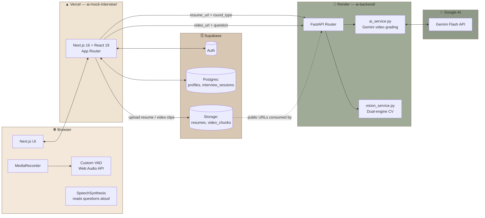
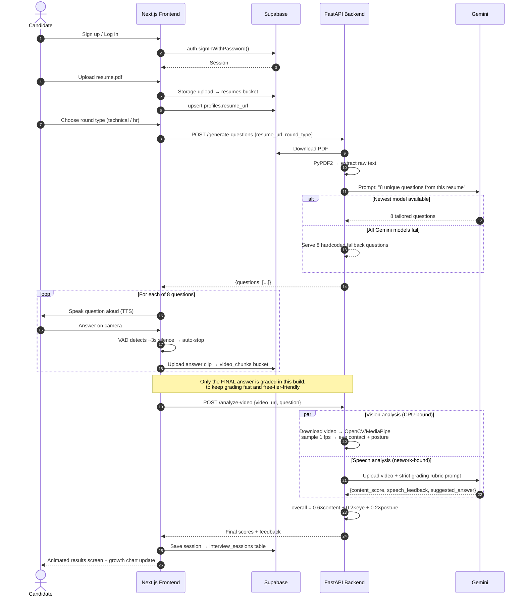
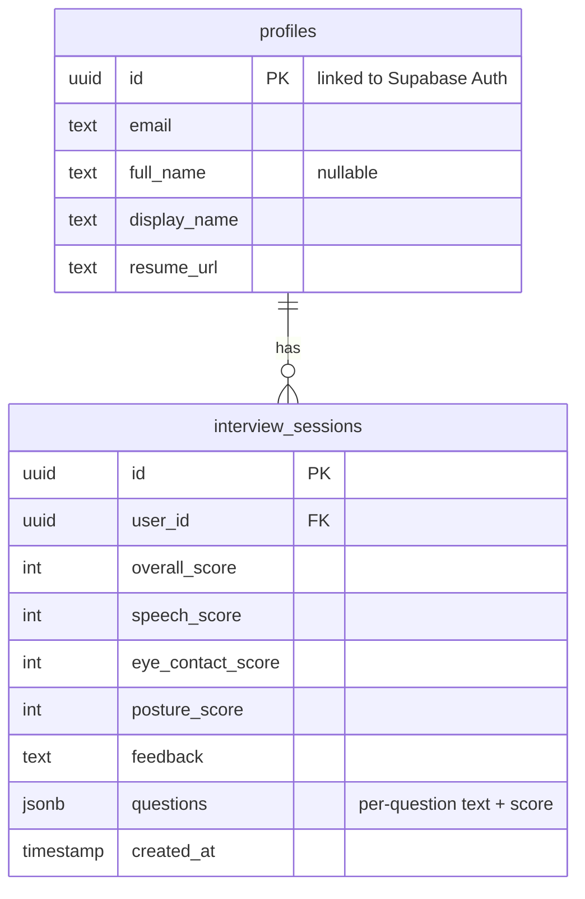

<div align="center">


### The interview practice you can't talk your way around.

**Upload a resume → get 8 questions built *from that resume* → answer on camera → get graded on what you said *and* how you said it.**


[Concept](#-the-core-idea) · [Architecture](#-system-architecture) · [How It Works](#-how-it-works-end-to-end-flow) · [Scoring Engine](#-the-scoring-engine) · [Tech Stack](#-tech-stack) · [Setup](#-local-development-setup) · [API](#-api-reference) · [Deployment](#-deployment-guide) · [Troubleshooting](#-known-issues--troubleshooting)

</div>

---

## 📖 Table of Contents

1. [The Core Idea](#-the-core-idea)
2. [Feature Overview](#-feature-overview)
3. [System Architecture](#-system-architecture)
4. [How It Works — End-to-End Flow](#-how-it-works-end-to-end-flow)
5. [The Scoring Engine](#-the-scoring-engine)
6. [Under the Hood — Engine Room Deep Dive](#-under-the-hood--engine-room-deep-dive)
7. [Tech Stack](#-tech-stack)
8. [Project Structure](#-project-structure)
9. [Database Schema](#-database-schema)
10. [API Reference](#-api-reference)
11. [Environment Variables](#-environment-variables)
12. [Local Development Setup](#-local-development-setup)
13. [Deployment Guide](#-deployment-guide)
14. [Known Issues & Troubleshooting](#-known-issues--troubleshooting)
15. [Design System](#-design-system)
16. [Roadmap](#-roadmap)
17. [Team](#-team)

---

## 💡 The Core Idea

Most "AI interview prep" tools ask you generic questions off a template. **MOCKSTAR reads your actual résumé** and generates interview questions specific to *your* projects, *your* stack, and *your* experience — then it puts you in front of a camera and grades you the way a real bar-raiser would: on the substance of what you said, whether you looked at the camera, and whether you sat like someone who's confident in the answer.

The entire platform is built to run at **₹0 hosting cost** on free tiers (Vercel + Render + Supabase + Gemini's free quota), which forces a very specific architectural pattern:

> **"Fake real-time."** Nothing is analyzed while you're talking. The frontend's only job during the interview is to *feel* like a live conversational interview — record you, know when you've stopped talking, and move to the next question. All the expensive AI/CV work (grading, eye-contact detection, posture analysis) happens **after** you finish, in one concentrated backend burst. This is the difference between an app that needs a GPU cluster and an app that runs on a free-tier server with 512MB of RAM.

---

## ✨ Feature Overview

| Feature | Description |
|---|---|
| 🔐 **Auth** | Email/password sign-up and login via Supabase Auth, with session persistence and route guarding |
| 📄 **Resume-aware questions** | Uploads a PDF, extracts real text (`PyPDF2`), and asks Gemini to write **8 unique, non-generic questions** grounded in that specific resume |
| 🎯 **Two interview modes** | `technical` round (architecture/debugging/scaling questions tied to the candidate's actual projects) or `hr` round (behavioral/scenario-based questions) — selectable before the session starts |
| 🗣️ **Text-to-Speech questions** | The browser's native `SpeechSynthesis` API reads each question aloud in a natural voice, so the session feels like a real conversation, not a quiz form |
| 🎙️ **Voice Activity Detection (VAD)** | A hand-built Web Audio pipeline listens to the mic and auto-stops recording after ~3 seconds of silence — no "Submit" button, no awkward waiting |
| 🎥 **Camera + mic capture** | `MediaRecorder` records each answer as a `.webm` clip directly in the browser |
| 🧠 **LLM speech grading** | Gemini watches the **actual video** of the final answer (not just a transcript) and grades content quality against a strict rubric, plus writes a model answer for comparison |
| 👁️ **Computer vision grading** | A dual-engine CV pipeline (MediaPipe with automatic OpenCV fallback) scores eye contact and posture, sampling exactly 1 frame per second to stay light on CPU |
| ⚡ **Concurrent analysis** | Vision scoring and speech scoring run in parallel (`asyncio.gather`) instead of sequentially, cutting grading latency roughly in half |
| 🛡️ **Self-healing question generation** | If the newest Gemini model is unavailable, the backend automatically walks backward through older model versions; if *all* of them fail, it silently serves 8 hand-written fallback questions so the user never sees a crash |
| 📊 **Results dashboard** | Animated score bars (Speech / Eye Contact / Posture), written feedback, and a suggested model answer per question |
| 📈 **Progress tracking** | A dashboard growth chart plots `overall_score` across every past session so a candidate can watch themselves actually improve |
| 🗂️ **Interview history** | Every session is saved and filterable (Strong / Mixed / Weak) with searchable feedback |
| 👤 **Profile management** | Editable display name, resume re-upload, average score breakdown, and account settings |

---

## 🏗️ System Architecture

MOCKSTAR is deliberately split into **two independently deployable services** that only talk to each other over plain HTTP — there is no shared runtime, no shared memory, and no tight coupling. This is what lets the frontend live on Vercel's edge network while the CPU-hungry vision/AI work lives on a completely separate machine.


```mermaid
flowchart LR
    subgraph Client["🌐 Browser"]
        direction TB
        UI[Next.js UI]
        MR[MediaRecorder]
        VAD[Custom VAD<br/>Web Audio API]
        TTS[SpeechSynthesis<br/>reads questions aloud]
    end

    subgraph Vercel["▲ Vercel — ai-mock-interview/"]
        FE[Next.js 16 + React 19<br/>App Router]
    end

    subgraph Supabase["🗄️ Supabase"]
        Auth[(Auth)]
        DB[(Postgres:<br/>profiles, interview_sessions)]
        Storage[(Storage:<br/>resumes, video_chunks)]
    end

    subgraph Render["🐍 Render — ai-backend/"]
        API[FastAPI Router]
        AIS["ai_service.py<br/>Gemini video grading"]
        VIS["vision_service.py<br/>Dual-engine CV"]
    end

    subgraph Google["✨ Google AI"]
        Gemini[Gemini Flash API]
    end

    UI <--> FE
    MR --> VAD
    FE <--> Auth
    FE <--> DB
    FE -- "upload resume / video clips" --> Storage
    FE -- "resume_url + round_type" --> API
    FE -- "video_url + question" --> API
    API --> AIS
    API --> VIS
    AIS <--> Gemini
    Storage -. "public URLs consumed by" .-> API

    style Client fill:#F3E8DA,stroke:#75624E,color:#2E2A25
    style Vercel fill:#EFE3D2,stroke:#75624E,color:#2E2A25
    style Supabase fill:#D8C7B3,stroke:#75624E,color:#2E2A25
    style Render fill:#A0AB97,stroke:#75624E,color:#2E2A25
    style Google fill:#8F9B88,stroke:#75624E,color:#2E2A25
```

**Why this shape?**
- **Vercel** never runs anything heavier than React — it stays fast and free forever.
- **Supabase** is the single source of truth for identity, relational data, and file storage, so both services can trust the same `resume_url` / `video_url` without passing raw files between each other.
- **Render** is the only place doing expensive work (PDF parsing, LLM calls, frame-by-frame CV), and it is stateless — it downloads what it needs by URL, processes it, deletes the temp file, and forgets everything.

---

## 🔄 How It Works — End-to-End Flow


```mermaid
sequenceDiagram
    autonumber
    actor U as Candidate
    participant FE as Next.js Frontend
    participant SB as Supabase
    participant BE as FastAPI Backend
    participant G as Gemini

    U->>FE: Sign up / Log in
    FE->>SB: auth.signInWithPassword()
    SB-->>FE: Session

    U->>FE: Upload resume.pdf
    FE->>SB: Storage upload → resumes bucket
    FE->>SB: upsert profiles.resume_url
    U->>FE: Choose round type (technical / hr)

    FE->>BE: POST /generate-questions {resume_url, round_type}
    BE->>SB: Download PDF
    BE->>BE: PyPDF2 → extract raw text
    BE->>G: Prompt: "8 unique questions from this resume"
    alt Newest model available
        G-->>BE: 8 tailored questions
    else All Gemini models fail
        BE-->>BE: Serve 8 hardcoded fallback questions
    end
    BE-->>FE: {questions: [...]}

    loop For each of 8 questions
        FE->>U: Speak question aloud (TTS)
        U->>FE: Answer on camera
        FE->>FE: VAD detects ~3s silence → auto-stop
        FE->>SB: Upload answer clip → video_chunks bucket
    end

    Note over FE,BE: Only the FINAL answer is graded in this build,<br/>to keep grading fast and free-tier-friendly

    FE->>BE: POST /analyze-video {video_url, question}
    par Vision analysis (CPU-bound)
        BE->>BE: Download video → OpenCV/MediaPipe<br/>sample 1 fps → eye contact + posture
    and Speech analysis (network-bound)
        BE->>G: Upload video + strict grading rubric prompt
        G-->>BE: {content_score, speech_feedback, suggested_answer}
    end
    BE->>BE: overall = 0.6×content + 0.2×eye + 0.2×posture
    BE-->>FE: Final scores + feedback

    FE->>SB: Save session → interview_sessions table
    FE-->>U: Animated results screen + growth chart update
```

---

## 🧮 The Scoring Engine

Every finished interview produces one **overall score**, computed as a weighted blend of three independent signals:

```
overall_score = (content_score   × 0.60)
              + (eye_contact_score × 0.20)
              + (posture_score     × 0.20)
```

| Signal | Weight | How it's measured |
|---|---|---|
| **Content** | 60% | Gemini watches the raw video (not a transcript) and grades against a deliberately strict rubric — most real answers should land **35–65**; scores of 85+ are reserved for genuinely exceptional answers. Filler, generic textbook answers, and confident-but-empty delivery are explicitly penalized. Silence or an inaudible answer is hard-capped at 0–9. |
| **Eye Contact** | 20% | Face-presence detection sampled once per second across the clip; percentage of sampled frames where a face is confidently detected, scaled down slightly to keep the metric honest |
| **Posture** | 20% | Shoulder-landmark stability (MediaPipe Pose) — if available — checking that both shoulders stay level and confidently tracked; falls back to a face-presence proxy if only OpenCV is available |

Gemini is also asked to write a **model answer** (3–5 sentences) for every question regardless of how the candidate actually performed, so the results screen always gives the candidate something concrete to learn from — not just a number.

---

## 🔬 Under the Hood — Engine Room Deep Dive

This section is the "basement" view — the actual mechanics behind each moving part, worth knowing if you're defending this project in a review or explaining it to a recruiter.

### 1. The Voice Activity Detection (VAD) Math
No third-party VAD library is used — it's built directly on the browser's native `AudioContext`:
1. The raw mic stream is piped into an `AudioContext`, with an `AnalyserNode` attached.
2. The `AnalyserNode` continuously runs an FFT (Fast Fourier Transform), converting the audio wave into frequency-domain data.
3. `getByteFrequencyData()` is sampled dozens of times per second and averaged into a single `volumeLevel`.
4. If `volumeLevel` stays below a calibrated silence threshold for ~3 continuous seconds, the script fires `mediaRecorder.stop()` on its own — no button press required.

### 2. Why the Backend Doesn't Freeze Under Load
FastAPI's request handlers are `async`, but AI/CV work is inherently CPU- and network-blocking. The `/analyze-video` endpoint solves this by wrapping both the vision pipeline and the Gemini call in `asyncio.to_thread(...)` and running them with `asyncio.gather(...)` — since posture/eye-contact analysis (local CPU) and video grading (waiting on Google's servers) touch the same file but depend on nothing from each other, running them concurrently roughly halves the time a candidate waits for results, instead of running one after the other.

### 3. Dual-Engine Computer Vision, With a Safety Net
`vision_service.py` tries to import `mediapipe` at startup. If MediaPipe loads successfully, the platform gets full **Face Detection + Pose** landmarks (468-point-class precision, shoulder-level posture tracking). If MediaPipe fails to load — which can happen on certain free-tier server architectures — the service **silently drops to a headless OpenCV Haar Cascade face detector** instead of crashing, and posture is estimated as a proxy off the face-presence signal. Either way, the API contract (`eye_contact_score`, `posture_score`) never changes — the frontend has no idea which engine ran.

### 4. Surviving a 512MB Free-Tier Server
Running full-resolution, full-framerate video through OpenCV or MediaPipe on a free-tier Render instance caused out-of-memory crashes and timeouts. The fix: the service reads the video's **actual FPS from its own metadata**, calculates the exact frame interval needed to land on **1 processed frame per second**, and skips everything else. This cut CPU workload by roughly 83% while keeping the eye-contact/posture signal statistically stable — a video's average gaze and posture don't meaningfully change frame-to-frame within the same second.

### 5. Self-Healing Question Generation
Rather than hardcoding a single Gemini model name (which breaks the moment a model is deprecated), `/generate-questions` calls `client.models.list()` at request time, filters to available "flash"-class models, sorts newest-first, and tries them **in order** until one succeeds. If every single model call fails — rate limit, outage, bad key — the endpoint doesn't throw a 500 back to the user. It silently returns 8 hand-written, resume-agnostic fallback questions, so a candidate mid-interview never sees a broken screen.

### 6. Guarding Against "No Answer" Clips
Before ever spending a Gemini API call, `ai_service.py` checks the downloaded video's file size. Anything under ~30KB is treated as "the candidate never actually spoke" (almost always caused by the VAD timeout firing near-instantly) and is scored `0` locally with an explanatory message — no wasted API call, no confusing AI hallucination about a video with no content.

### 7. JSON-Only AI Output
Asking an LLM to "grade an interview" naively returns a conversational essay, which is useless to a React frontend expecting structured data. The Gemini call sets `response_mime_type="application/json"` and demands an exact 3-key schema (`content_score`, `speech_feedback`, `suggested_answer`) — the frontend can safely `JSON.parse()` the result every time.

---

## 🧰 Tech Stack

### Frontend — `ai-mock-interview/`
| Tool | Role |
|---|---|
| **Next.js 16** (App Router) | UI framework, routing, session-aware layouts |
| **React 19** | Component layer |
| **TypeScript** | Type safety across the app |
| **Supabase JS SDK** | Auth + Postgres + Storage client |
| **MediaRecorder API** (browser-native) | Captures audio + video per question |
| **Web Audio API** (hand-written) | Custom Voice Activity Detection — no third-party VAD library |
| **SpeechSynthesis API** (browser-native) | Reads each question aloud in a natural voice |
| Hand-rolled inline SVG charts | Animated score bars and growth-over-time chart — no charting library dependency |

### Backend — `ai-backend/`
| Tool | Role |
|---|---|
| **FastAPI** | REST API server (`main.py` + modular `routers/`) |
| **PyPDF2** | Extracts raw text from uploaded resume PDFs |
| **google-genai SDK** | Generates interview questions from resume text; grades spoken video answers directly (no separate transcription step) |
| **OpenCV** (`opencv-python-headless`) | Frame-by-frame face detection; primary engine when MediaPipe is unavailable |
| **MediaPipe** | Preferred CV engine — face detection + pose/posture landmarks — with automatic fallback to OpenCV |
| **asyncio** | Runs vision analysis and speech grading concurrently per answer |

### Auth, Database & Storage
| Tool | Role |
|---|---|
| **Supabase Auth** | Email/password authentication, session management |
| **Supabase Postgres** | `profiles` and `interview_sessions` tables |
| **Supabase Storage** | `resumes` bucket (PDFs) and `video_chunks` bucket (answer recordings) |

### Hosting — the ₹0 stack
| Service | Hosts | Why |
|---|---|---|
| **Vercel** | `ai-mock-interview/` frontend | Free tier, zero-config Next.js deploys, generous free bandwidth |
| **Render** | `ai-backend/` FastAPI service | Free tier web service with a real Python runtime for OpenCV/MediaPipe |
| **Supabase** | Auth + DB + Storage | Free tier covers auth, a relational Postgres DB, and file storage in one place |
| **Google AI** | Gemini Flash | Free-tier API quota is enough for question generation + video grading at hobby/demo scale |

---

## 📁 Project Structure

```
MOCKSTAR/
├── ai-mock-interview/                 ← Frontend (deploy to Vercel)
│   ├── app/
│   │   ├── page.tsx                   ← Landing page (auto-redirects if logged in)
│   │   ├── login/page.tsx             ← Login / signup
│   │   ├── upload/page.tsx            ← Resume upload + round-type selection
│   │   ├── interview/page.tsx         ← 🎬 Camera, TTS questions, VAD recording, live results
│   │   ├── (app)/
│   │   │   ├── layout.tsx             ← Shared authenticated shell (Sidebar)
│   │   │   ├── dashboard/page.tsx     ← Growth chart, quick stats, "Start Interview"
│   │   │   ├── history/page.tsx       ← Filterable past-session archive
│   │   │   └── profile/page.tsx       ← Account settings, average score breakdown
│   │   ├── components/
│   │   │   ├── Sidebar.tsx            ← Persistent nav (Dashboard / History / Profile)
│   │   │   └── Logo.tsx               ← MockStar SVG mark
│   │   └── layout.tsx                 ← Root layout
│   ├── lib/
│   │   └── supabaseClient.js          ← Supabase client init
│   └── package.json
│
└── ai-backend/                        ← Backend (deploy to Render)
    ├── main.py                        ← FastAPI app entrypoint, CORS, health check
    ├── routers/
    │   └── interview.py                ← /generate-questions, /analyze-video
    ├── services/
    │   ├── ai_service.py               ← Gemini video-grading logic + strict rubric prompt
    │   └── vision_service.py           ← Dual-engine (MediaPipe/OpenCV) CV pipeline
    ├── models/
    │   └── schemas.py                  ← Pydantic request models
    └── requirements.txt
```

---

## 🗄️ Database Schema


```mermaid
erDiagram
    profiles ||--o{ interview_sessions : "has"
    profiles {
        uuid id PK "linked to Supabase Auth"
        text email
        text full_name "nullable"
        text display_name
        text resume_url
    }
    interview_sessions {
        uuid id PK
        uuid user_id FK
        int overall_score
        int speech_score
        int eye_contact_score
        int posture_score
        text feedback
        jsonb questions "per-question text + score"
        timestamp created_at
    }
```

- **`profiles`** — one row per authenticated user; holds the resume URL so it doesn't need to be re-uploaded every session.
- **`interview_sessions`** — one row per completed interview; powers the History page, the Profile average-score breakdown, and the Dashboard growth chart.
- **Storage buckets** — `resumes` (uploaded PDFs) and `video_chunks` (recorded answer clips), both referenced by public URL rather than passed as raw bytes between services.

---

## 🔌 API Reference

Base URL: your Render deployment (e.g. `https://mockstar-3.onrender.com`)

### `POST /generate-questions`
Generates 8 tailored interview questions from a candidate's resume.

**Request body**
```json
{
  "resume_url": "https://<project>.supabase.co/storage/v1/object/public/resumes/xyz.pdf",
  "round_type": "technical"
}
```
`round_type` accepts `"technical"` (default) or `"hr"`.

**Response**
```json
{ "questions": ["Question 1...", "Question 2...", "... up to 8"] }
```

If the resume can't be parsed or every available Gemini model fails, the endpoint still returns `200` with **8 hardcoded fallback questions** rather than an error — the interview never breaks for the candidate.

---

### `POST /analyze-video`
Grades a single answer clip on content, eye contact, and posture.

**Request body**
```json
{
  "video_url": "https://<project>.supabase.co/storage/v1/object/public/video_chunks/xyz.webm",
  "question": "Tell me about a time you had a technical disagreement with a teammate."
}
```

**Response**
```json
{
  "overall_score": 61,
  "content_score": 58,
  "eye_contact_score": 72,
  "posture_score": 65,
  "feedback": "The candidate described the disagreement but didn't explain the resolution mechanism in detail...",
  "suggested_answer": "A strong answer would walk through the specific technical tradeoff, how each side's reasoning was heard..."
}
```

### `GET /` and `GET /health`
Root and health-check endpoints — the latter is intended for a free-tier keep-alive cron job, since Render's free web services sleep after inactivity.

---

## 🔑 Environment Variables

### Frontend — set in Vercel (Project → Settings → Environment Variables) or `.env.local` locally
| Variable | Where to get it |
|---|---|
| `NEXT_PUBLIC_SUPABASE_URL` | Supabase → Settings → API → Project URL (must end in `.co`, **not** the `supabase.com/dashboard` link) |
| `NEXT_PUBLIC_SUPABASE_ANON_KEY` | Supabase → Settings → API → `anon` `public` key |
| `NEXT_PUBLIC_BACKEND_URL` | Your Render backend URL, no trailing slash |

### Backend — set in Render (Service → Environment) or `.env` locally
| Variable | Notes |
|---|---|
| `GEMINI_API_KEY` | Required — every AI endpoint fails without it |
| `PYTHON_VERSION` | Pin to `3.12.7` — Render's newer default Python breaks the pinned `grpcio`/`google-api-core` versions (see [Known Issues](#-known-issues--troubleshooting)) |

Neither `.env` file should ever be committed — both `.gitignore` files already exclude them.

---

## 🖥️ Local Development Setup

### Backend
```bash
cd ai-backend
python -m venv venv
source venv/bin/activate        # Windows: venv\Scripts\activate
pip install -r requirements.txt
```
Create `ai-backend/.env`:
```env
GEMINI_API_KEY=your_key_here
```
Run:
```bash
uvicorn main:app --reload --port 8000
```

### Frontend
```bash
cd ai-mock-interview
npm install
```

Run:
```bash
npm run dev
```
Then open `http://localhost:3000`.

---

## 🚀 Deployment Guide

Deploy in this exact order — backend first, frontend second, then close the loop on CORS. Skipping the order just means retracing your steps later.

### 1. Backend on Render
- **New → Web Service** → connect this repo
- **Root Directory:** `ai-backend`
- **Build command:** `pip install -r requirements.txt`
- **Start command:** `uvicorn main:app --host 0.0.0.0 --port $PORT`
- Add environment variables: `GEMINI_API_KEY`, `PYTHON_VERSION=3.12.7`
- Deploy → copy the live service URL

### 2. Frontend on Vercel
- **New Project** → import this repo
- **Root Directory:** `ai-mock-interview`
- Framework preset: Next.js (auto-detected)
- Add environment variables: `NEXT_PUBLIC_SUPABASE_URL`, `NEXT_PUBLIC_SUPABASE_ANON_KEY`, `NEXT_PUBLIC_BACKEND_URL` (the Render URL from step 1)
- Deploy → copy the **short production URL** (e.g. `mockstar-7414.vercel.app` — ignore the longer `-git-main-...` preview URLs)

### 3. Close the loop — update CORS
In `ai-backend/main.py`, restrict `allow_origins` to your exact production Vercel URL once you're ready for production hardening:
```python
allow_origins=["http://localhost:3000", "https://your-actual-vercel-url.vercel.app"],
```
Commit and push — Render auto-redeploys on every push to `main`.

### 4. Test on the live URLs
Don't just trust a green build — walk through signup → resume upload → full interview → results screen on the actual deployed site before calling it done.

---

## 🐛 Known Issues & Troubleshooting

Real problems hit while building and deploying this exact project — worth checking here before re-debugging from scratch.

| Problem | Cause | Fix |
|---|---|---|
| `ResolutionImpossible` on Render build | Render's default Python (3.14+) conflicts with pinned `grpcio-status` / `google-api-core` versions | Set `PYTHON_VERSION=3.12.7` in Render's environment variables |
| Generic "Error setting up interview" alert | Original code swallows the real error into a hardcoded `alert()` | Temporarily log `err.message` in the `catch` block while debugging |
| CORS errors in browser console | `allow_origins` in `main.py` doesn't contain the exact production Vercel URL | Add the exact URL — Vercel preview URLs (`-git-main-...`) are separate origins and need their own entry |
| Changed a Vercel env var but nothing changed | `NEXT_PUBLIC_*` variables are baked in at **build time**, not read at runtime | Trigger a new deployment (Deployments → "..." → Redeploy) |
| Render free-tier OOM crash / timeout during video analysis | MediaPipe + OpenCV at full framerate exceed the 512MB free-tier RAM ceiling | `vision_service.py` dynamically calculates FPS and processes exactly 1 frame/second — cuts CPU load ~83% (cold-start delay after 15 min idle still applies) |
| Black video box, camera permission granted, no error | React ref timing bug — the `<video>` element doesn't exist yet while still on the loading screen when the stream attaches | A second `useEffect` re-attaches the stream once the video element actually mounts |
| `Failed to fetch` on login/signup | `.env.local` has the browser dashboard URL instead of the actual `.co` API endpoint | Use the Project URL from Supabase → Settings → API, not the dashboard link |
| Resume upload succeeds but DB write fails | Storage Row Level Security blocks the insert | Add SQL policy: `bucket_id = 'resumes' AND auth.role() = 'authenticated'` |
| 500 error on first resume upload | `full_name` column has a `NOT NULL` constraint the frontend never populates | Alter the column to be nullable |

---

## 🎨 Design System

MOCKSTAR uses a warm, sage-and-sand palette instead of the generic dark-mode SaaS look:

| Swatch | Hex | Used for |
|---|---|---|
| 🟫 | `#75624E` | Sidebar, deep accents |
| 🟩 | `#A0AB97` | Primary accent, active states, speech-score bar |
| 🟩 | `#8F9B88` | Secondary accent, eye-contact bar, chart line |
| 🟤 | `#D8C7B3` | Progress-bar tracks, borders |
| 🟨 | `#F3E8DA` / `#EFE3D2` | Page backgrounds |

Charts, score bars, and the growth graph are hand-drawn inline SVG (no charting library), animated in with `strokeDashoffset` transitions and staggered fade-ins for a polished, premium feel without adding bundle weight.

---

## 🗺️ Roadmap

- [ ] Grade **every** question, not just the final answer, without blowing the free-tier request budget
- [ ] Real-time CV feedback during the interview itself (needs server-grade hardware to be feasible)
- [ ] Support additional resume formats (DOCX, LinkedIn export PDF)
- [ ] Peer / cohort comparison analytics
- [ ] Configurable question count and difficulty per round

---

## 👥 Team

| Name | Roll No. | Focus |
|---|---|---|
| **Aman** | 2401010141 | Auth, DB schema, PDF extraction, FastAPI backend, CV integration |
| **Aryan** | 2401010005 | Auth, frontend UI, MediaRecorder, Voice Activity Detection |
| **Gaurav** | 2401010009 | Gemini feedback synthesis, testing, deployment |

**Faculty Mentor:** Ms. Neetu Chauhan

---

<div align="center">

**Built to run entirely on free tiers — because a good practice interview shouldn't cost anything to build.**

</div>
